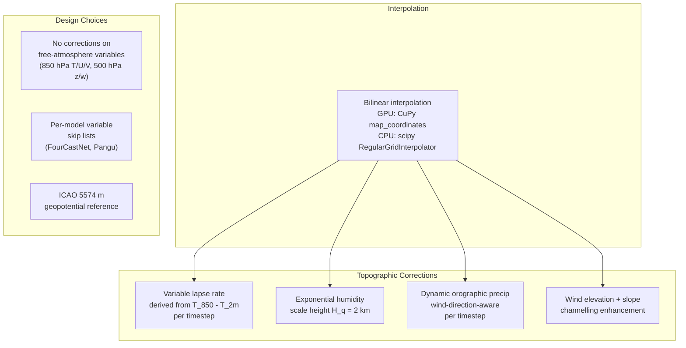

# Scientific Review

Scientific audit of the walkthru-weather-index pipeline calculations, cross-referenced against peer-reviewed literature (2020-2026). This document records the methodology choices, their justification, and supporting references.

---

## Methodology Summary



---

## 1. Interpolation Method

### Bilinear interpolation (production method)

The pipeline uses bilinear interpolation to map weather variables from the regular 0.25-degree NOAA grid onto irregular H3 cell centres.

**GPU path**: CuPy `map_coordinates(order=1)` converts target lat/lon to fractional grid indices and performs hardware-accelerated bilinear interpolation. Longitude wrap-around is handled via circular padding; latitude is clamped at poles. Complexity: O(N) per timestep.

**CPU fallback**: scipy `RegularGridInterpolator(method='linear')` with nearest-neighbour fill for residual NaN values.

For a regular 0.25-degree source grid (~28 km spacing) being interpolated to H3 res 5 cells (~15 km edge length), bilinear interpolation is the scientifically standard method used by major downscaling systems (ERA5, CHELSA, CHELSA-W5E5). The source grid is dense enough that bilinear interpolation captures the spatial structure faithfully.

### Note on Gaussian kernel smoothing (RBF)

Gaussian kernel smoothing (Nadaraya-Watson kernel regression) can provide smoother interpolation with configurable bandwidth, which may be preferable for regional applications where source points are sparse or irregularly spaced. However, the Gaussian kernel has O(N * S) complexity (N targets x S source points), making it computationally prohibitive for global runs:

| Scope | Source points (S) | Targets (N) | Kernel ops/timestep | Estimated time |
|---|---|---|---|---|
| Regional (0.5 deg) | ~9 | ~2,000 | 18,000 | < 1 sec |
| Global | 1,038,240 | 2,016,842 | 2 x 10^12 | 10+ hours |

For regional BBOX configurations, Gaussian kernel smoothing remains a viable option and could be re-enabled as a configurable interpolation method in a future release.

**References:**
- Fasshauer (2007), *Meshfree Approximation Methods with MATLAB*
- Bukovsky & Mearns (2021), *JAMC*, doi:10.1175/JAMC-D-20-0259.1

---

## 2. Pressure Level Indexing

The NOAA AI-NWP archive uses a 13-level pressure set ordered as:

```
Index: 0     1     2     3     4     5     6     7     8     9    10    11    12
Level: 1000  925   850   700   600   500   400   300   250   200  150   100    50 hPa
```

The pipeline extracts:
- 850 hPa variables (temperature, u-wind, v-wind) at index 2
- 500 hPa variables (vertical velocity, geopotential) at index 5

Pressure levels are sorted in descending order (1000 > 50 hPa) at load time to ensure consistent indexing regardless of the source file ordering.

**References:**
- DART Pangu-Weather documentation
- NOAA AIWP registry on AWS

---

## 3. Model Variable Availability

Not all four supported models output the same variables:

| Variable | GraphCast | FourCastNet | Pangu-Weather |
|---|---|---|---|
| Specific humidity (q) | kg/kg | **Relative humidity (%)** | kg/kg |
| Precipitation (apcp) | 6h accumulated | **Not available** | **Not available** |
| Vertical velocity (w) | Available | **Not available** | **Not available** |

FourCastNet's moisture variable is relative humidity (0-100%), not specific humidity. The pipeline uses per-model `skip_vars` lists in `AI_MODELS` config to exclude unavailable variables. Downstream derived quantities (moisture flux, etc.) are computed only when their inputs are present.

**References:**
- Lam et al. (2023), *Science*, doi:10.1126/science.adi2336
- NOAA AIWP registry documentation

---

## 4. Specific Humidity Unit Conversion

NOAA AI-NWP models output specific humidity in kg/kg (SI convention, typical values 0.001-0.025). The pipeline converts to g/kg (multiply by 1000) when the spatial mean is < 1.0, confirming kg/kg input. This ensures correct downstream moisture flux products.

**References:**
- ECMWF Parameter Database, parameter 133: kg/kg
- WMO-No. 8 (2018), Guide to Instruments and Methods of Observation

---

## 5. Free-Atmosphere Variables: No Terrain Correction

Variables on pressure levels (850 hPa temperature, 850 hPa winds, 500 hPa geopotential, 500 hPa vertical velocity) receive **no** topographic correction. These are free-atmosphere variables decoupled from the surface boundary layer. Published downscaling systems (CHELSA-W5E5, TopoSCALE, MicroMet) exclusively apply terrain corrections to surface variables.

**References:**
- Karger et al. (2023), *ESSD*, doi:10.5194/essd-15-2445-2023
- Fiddes & Gruber (2014), *GMD*, doi:10.5194/gmd-7-387-2014
- Gao et al. (2012), *HESS*, doi:10.5194/hess-16-4661-2012

---

## 6. Humidity Elevation Correction

Specific humidity follows an exponential profile with altitude: `q(z) = q0 * exp(-z/H_q)` where the moisture scale height H_q = 2.0 km.

| Elevation difference | Correction factor |
|---|---|
| +500 m | 0.78 (-22%) |
| +1000 m | 0.61 (-39%) |
| +2000 m | 0.37 (-63%) |
| -500 m | 1.28 (+28%) |

The correction factor is clamped to [0.05, 1.5] to prevent unphysical extremes.

**References:**
- Held & Soden (2006), *J. Climate*, doi:10.1175/JCLI3990.1
- Trenberth et al. (2005), *J. Hydrometeorol.*

---

## 7. Dynamic Wind Direction for Orographic Precipitation

The orographic precipitation enhancement uses the actual wind direction from the model's u10/v10 fields at each timestep (not a fixed prevailing direction). This captures timestep-to-timestep variability, which is critical for episodic precipitation events.

```python
wind_dir = (arctan2(-u10, -v10) * 180/pi) % 360  # per timestep, per point
# Compare slope aspect to wind direction dynamically
```

Falls back to neutral factor (no directional enhancement) when u10/v10 are not available.

**References:**
- Karger et al. (2017), *Scientific Data*, doi:10.1038/sdata2017122 (CHELSA algorithm)
- Roe & Baker (2019), *Scientific Reports*, doi:10.1038/s41598-019-49974-5

---

## 8. Geopotential Anomaly Reference

The 500 hPa geopotential anomaly uses the ICAO Standard Atmosphere reference height of **5574 m** as a global default. This is configurable via `GEOPOTENTIAL_500_REF` in `config.py` for region-specific deployments.

**References:**
- ICAO (1993), Manual of the ICAO Standard Atmosphere, Doc 7488
- ERA5 1991-2020 climatology (Hersbach et al., 2020, *QJRMS*, doi:10.1002/qj.3803)

---

## 9. Variable Lapse Rate

The temperature lapse rate is derived per timestep from the model's own T_850 and T_2m spatial means:

$$\Gamma_t = \frac{\overline{T_{850} - T_{2m}}}{z_{850} - z_{ref}}$$

Clamped to [-9.8, +5.0] deg C/km (dry adiabatic to strong inversion). Falls back to fixed -6.5 deg C/km (ISA) when T_850 is unavailable.

This approach (Karger et al. 2023, CHELSA-W5E5) captures diurnal, seasonal, and synoptic variability in the lapse rate, avoiding systematic biases from fixed values -- especially important for arid regions with strong nocturnal inversions.

**References:**
- Karger et al. (2023), *ESSD*, doi:10.5194/essd-15-2445-2023
- Dutra et al. (2020), *Earth & Space Science*, doi:10.1029/2019EA000984
- Blandford et al. (2008), *JAMC*, doi:10.1175/2007JAMC1565.1

---

## 10. DEM Terrain Derivatives

The H3 Parquet DEM (from [walkthru-earth/dem-terrain](https://github.com/walkthru-earth/dem-terrain)) includes pre-computed slope, aspect, TRI, and TPI values per H3 cell. For the STAC raster fallback, these derivatives are computed on-the-fly:

- **Slope/aspect**: Computed with `np.gradient` / `cupy.gradient` using metric spacings (dx, dy in metres). Latitude array is forced ascending before gradient computation to ensure correct aspect orientation.
- **TRI**: Riley et al. (1999) formulation -- RMS deviation of elevation differences between center cell and 3x3 neighbours.
- **TPI**: Elevation minus mean of surrounding 5x5 neighbourhood.

**References:**
- Riley et al. (1999), *Intermountain Journal of Sciences*, 5(1-4), 23-27
- Horn (1981), *Proceedings of the IEEE*, 69(1), 14-47
- Wilson et al. (2007), *Marine Geodesy*, 30(1-2), 3-35

---

## Known AI-NWP Model Biases

The pipeline processes output from NOAA-hosted AI weather models. Key known limitations:

### Temperature

All models show a "stale climate" cold bias for the hottest temperature events (Zhang et al., 2025, arXiv:2509.22359):
- FourCastNet: -0.91 K for the hottest decile
- Pangu-Weather: -0.34 K for the hottest decile
- Especially relevant for hot-climate summer extremes (>45 deg C)

### Wind

Extreme 10 m wind speeds are systematically underestimated (Donat et al., 2024, *GMD*, doi:10.5194/gmd-17-7915-2024).

### Precipitation

- GraphCast precipitation was excluded from the original skill evaluation
- Drizzle bias from conservation violations may produce spurious light precipitation in arid regions
- Orographic enhancement corrections amplify any spurious signal

### Physical Consistency

AI models do not enforce thermodynamic or mass conservation. Negative specific humidity values are possible. The relationship between q, T, and precipitation is not guaranteed to be physically consistent (Bonavita, 2024, *GRL*, doi:10.1029/2023GL107377).

---

## Wind Shear Thresholds

The pipeline computes 850 hPa-10m bulk wind shear, which is a **low-level shear** metric (~0-1.5 km layer). Interpretation:

| Value | Interpretation |
|---|---|
| < 5 m/s | Weak low-level shear |
| 5-10 m/s | Moderate; mesoscale organisation possible |
| > 10 m/s | Strong low-level shear; low-level jet signature |

Note: Standard supercell thresholds derived from US Great Plains climatology are not directly transferable to other convective environments. The depth of the 850 hPa-10 m layer depends on the surface elevation of the target region.

**References:**
- Rasmussen & Blanchard (1998), *Weather and Forecasting*
- Thompson et al. (2003), *Weather and Forecasting*
- Markowski & Richardson (2010), *Mesoscale Meteorology in Midlatitudes*

---

## Full Reference List

1. Blandford et al. (2008). *JAMC*, doi:10.1175/2007JAMC1565.1
2. Bonavita (2024). *GRL*, doi:10.1029/2023GL107377
3. Bukovsky & Mearns (2021). *JAMC*, doi:10.1175/JAMC-D-20-0259.1
4. Donat et al. (2024). *GMD*, doi:10.5194/gmd-17-7915-2024
5. Durran (1990). AMS Meteorological Monographs
6. Dutra et al. (2020). *Earth & Space Science*, doi:10.1029/2019EA000984
7. Fasshauer (2007). *Meshfree Approximation Methods with MATLAB*
8. Fiddes & Gruber (2014). *GMD*, doi:10.5194/gmd-7-387-2014
9. Gao et al. (2012). *HESS*, doi:10.5194/hess-16-4661-2012
10. Held & Soden (2006). *J. Climate*, doi:10.1175/JCLI3990.1
11. Hersbach et al. (2020). *QJRMS*, doi:10.1002/qj.3803
12. Horn (1981). *Proceedings of the IEEE*, 69(1), 14-47
13. ICAO (1993). Manual of the ICAO Standard Atmosphere, Doc 7488
14. Karger et al. (2017). *Scientific Data*, doi:10.1038/sdata2017122
15. Karger et al. (2023). *ESSD*, doi:10.5194/essd-15-2445-2023
16. Lam et al. (2023). *Science*, doi:10.1126/science.adi2336
17. Markowski & Richardson (2010). *Mesoscale Meteorology in Midlatitudes*
18. Rasmussen & Blanchard (1998). *Weather and Forecasting*
19. Riley et al. (1999). *Intermountain J. Sciences*, 5(1-4), 23-27
20. Roe & Baker (2019). *Scientific Reports*, doi:10.1038/s41598-019-49974-5
21. Smith (1979). *Advances in Geophysics*, 21, 87-230
22. Thompson et al. (2003). *Weather and Forecasting*
23. Trenberth et al. (2005). *J. Hydrometeorol.*
24. Wilson et al. (2007). *Marine Geodesy*, 30(1-2), 3-35
25. Yue et al. (2024). *Heliyon*, doi:10.1016/j.heliyon.2024.e31964
26. Zhang et al. (2025). arXiv:2509.22359
