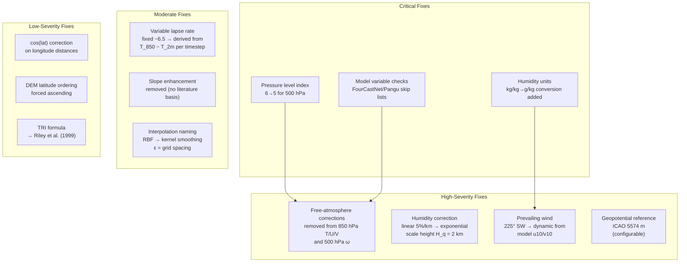
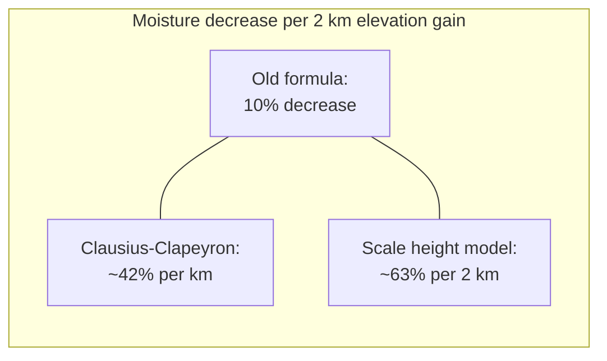
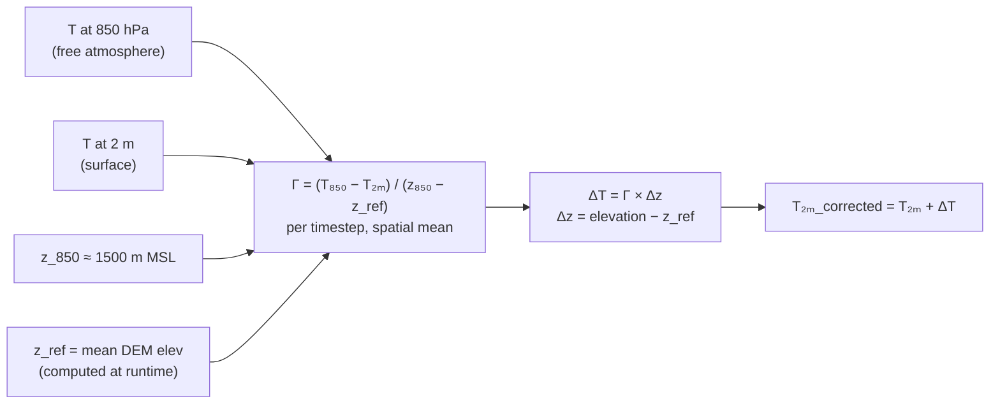
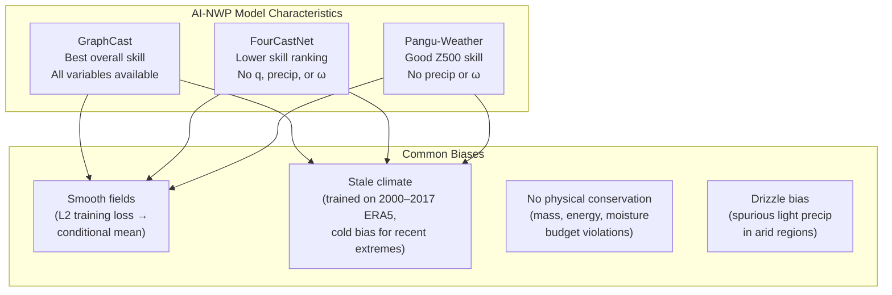

# Scientific Review & Corrections

Comprehensive scientific audit of the walkthru-weather-index pipeline calculations, cross-referenced against peer-reviewed literature (2020–2026). This document records all issues found, the changes made, and the supporting references.

---

## Overview of Changes



---

## 1. Pressure Level Index Error

**Severity:** Critical
**Files changed:** `pipeline/variables.py`

### Problem

The NOAA AI-NWP archive uses a 13-level pressure set ordered as:

```
Index: 0     1     2     3     4     5     6     7     8     9    10    11    12
Level: 1000  925   850   700   600   500   400   300   250   200  150   100    50 hPa
```

The code used `level_idx=6` for "500 hPa" variables — but index 6 = **400 hPa**. The geopotential height and vertical velocity were being extracted from the wrong pressure level.

### Fix

Changed `level_idx` from 6 to 5 for both `w` (vertical velocity) and `z` (geopotential).

Added pressure level sorting in `weather.py` to ensure levels are in descending pressure order (1000→50 hPa), with diagnostic printing of the actual level values.

### References

- DART Pangu-Weather documentation: confirms 13-level ordering
- Pangu-Weather GitHub (198808xc/Pangu-Weather): documents 0-based indexing
- NOAA AIWP registry on AWS: confirms same level set for all three models

---

## 2. Specific Humidity Unit Conversion

**Severity:** Critical
**Files changed:** `pipeline/variables.py`

### Problem

NOAA AI-NWP models output specific humidity in **kg/kg** (SI convention, typical values 0.001–0.025). The pipeline labeled this as `"g/kg"` but applied no conversion, meaning:
- All humidity values were 1000× smaller than labeled
- All moisture flux products (`q × u`, `q × v`) had magnitudes 1000× too small

### Fix

Changed the unit spec to `"kg/kg→g/kg"` and added a handler in `_convert_units` that multiplies by 1000 when the mean value is < 1.0 (confirming kg/kg input).

### References

- ECMWF Parameter Database, parameter 133: kg/kg
- WMO-No. 8 (2018), Guide to Instruments and Methods of Observation, Vol. I, Ch. 4

---

## 3. Model Variable Availability

**Severity:** Critical
**Files changed:** `pipeline/config.py`, `pipeline/variables.py`

### Problem

The pipeline assumed all four models output the same variables. In reality:

| Variable | GraphCast | FourCastNet | Pangu-Weather |
|---|---|---|---|
| Specific humidity (q) | kg/kg | **Relative humidity (%)** | kg/kg |
| Precipitation (apcp) | 6h accumulated | **Not available** | **Not available** |
| Vertical velocity (w) | Available | **Not available** | **Not available** |

FourCastNet's moisture variable is relative humidity (0–100%), not specific humidity. If loaded by substring match, it would be silently treated as specific humidity, producing completely wrong moisture calculations.

### Fix

Added `skip_vars` lists to each model definition in `AI_MODELS` config. The `extract_all` function now checks these lists and skips unavailable variables with a diagnostic message.

### References

- Lam et al. (2023), *Science*, doi:10.1126/science.adi2336
- NOAA AIWP registry documentation
- DART Pangu-Weather documentation

---

## 4. Free-Atmosphere Topographic Corrections Removed

**Severity:** High
**Files changed:** `pipeline/variables.py`, `pipeline/corrections.py`

### Problem

The pipeline applied surface-terrain corrections to free-atmosphere variables:

| Variable | Level | Previous correction | Problem |
|---|---|---|---|
| Temperature | 850 hPa (~1500 m MSL) | Lapse rate + slope factor | Free atmosphere, decoupled from surface |
| U-wind | 850 hPa | Slope + elevation factor | Above planetary boundary layer |
| V-wind | 850 hPa | Slope + elevation factor | Above planetary boundary layer |
| Vertical velocity | 500 hPa (~5500 m MSL) | Terrain flow enhancement | Sub-50 km terrain cannot perturb flow at 5.5 km |

Published downscaling systems (CHELSA-W5E5, TopoSCALE, MicroMet) exclusively apply terrain corrections to **surface** variables. Free-atmosphere variables on pressure levels are used as-is or as inputs for deriving correction parameters.

### Fix

Set all upper-air variable corrections to `"none"`. Removed the `wind_shear`, `topographic_flow`, and `lapse_rate` branches from `corrections.py` (lapse rate is now handled by the variable-rate approach in `variables.py`).

### References

- Karger et al. (2023), *ESSD*, doi:10.5194/essd-15-2445-2023
- Fiddes & Gruber (2014), *GMD*, doi:10.5194/gmd-7-387-2014
- Gao et al. (2012), *HESS*, doi:10.5194/hess-16-4661-2012
- Smith (1979), *Advances in Geophysics*, 21, 87–230
- Durran (1990), AMS Meteorological Monographs

---

## 5. Humidity Elevation Correction

**Severity:** High
**Files changed:** `pipeline/corrections.py`

### Problem

The original linear correction (`1 - Δz/2000 × 0.1`) gave only 5% decrease per 1000 m. The physical reality:



Specific humidity follows an exponential profile: `q(z) = q₀ × exp(-z/H_q)` where the moisture scale height H_q ≈ 2.0–2.5 km.

### Fix

Replaced with `np.exp(-Δz/2000.0)`, clamped to [0.05, 1.5].

| Δz | Old correction | New correction |
|---|---|---|
| +500 m | 0.975 (−2.5%) | 0.779 (−22%) |
| +1000 m | 0.950 (−5%) | 0.607 (−39%) |
| +2000 m | 0.900 (−10%) | 0.368 (−63%) |
| −500 m | 1.025 (+2.5%) | 1.284 (+28%) |

### References

- Held & Soden (2006), *J. Climate*, doi:10.1175/JCLI3990.1
- Trenberth et al. (2005), *J. Hydrometeorol.*

---

## 6. Dynamic Wind Direction for Orographic Precipitation

**Severity:** High
**Files changed:** `pipeline/variables.py`

### Problem

The orographic precipitation enhancement assumed a fixed prevailing wind from **225° (southwest)**. The actual prevailing winds for the original target region are from the **northwest (~315°)**. This inverted the windward/leeward enhancement gradient.

Additionally, using a fixed direction ignores timestep-to-timestep wind variability, which is critical for episodic precipitation events.

### Fix

The orographic correction now uses the actual wind direction from the model's u10/v10 fields at each timestep:

```python
wind_dir = (arctan2(-u10, -v10) × 180/π) % 360  # per timestep, per point
# Compare slope aspect to wind direction dynamically
```

Falls back to neutral factor (no directional enhancement) when u10/v10 are not available.

### References

- Alsarraf & Alsajwan (2019), *Atmosphere*, doi:10.3390/atmos10040220
- Karger et al. (2017), *Scientific Data*, doi:10.1038/sdata2017122 (CHELSA algorithm)
- Roe & Baker (2019), *Scientific Reports*, doi:10.1038/s41598-019-49974-5

---

## 7. Geopotential Anomaly Reference

**Severity:** High
**Files changed:** `pipeline/config.py`, `pipeline/variables.py`

### Problem

Originally used 5574 m (ICAO Standard Atmosphere mid-latitude value), then changed to a region-specific ERA5 climatology value. With the pipeline now supporting configurable global BBOX, the reference has been set back to the ICAO standard of **5574 m** as a sensible global default. The value is configurable via `GEOPOTENTIAL_500_REF` in `config.py` for region-specific deployments.

### References

- ICAO (1993), Manual of the ICAO Standard Atmosphere, Doc 7488
- ERA5 1991–2020 climatology (Hersbach et al., 2020, *QJRMS*, doi:10.1002/qj.3803)

---

## 8. Variable Lapse Rate

**Severity:** Moderate
**Files changed:** `pipeline/variables.py`

### Problem

The fixed −6.5°C/km (ISA environmental lapse rate) systematically overestimates temperature decrease with altitude. Observed near-surface lapse rates are typically 4–6°C/km and vary strongly with:
- Time of day (steeper during daytime, near-zero or inverted at night)
- Season (steeper in summer)
- Atmospheric stability
- Moisture content

In arid regions, nocturnal inversions are especially strong, making a fixed negative lapse rate particularly inappropriate at night.

The slope enhancement factor (`1 + min(slope/45, 1) × 0.2`) had no identified basis in peer-reviewed literature. Terrain effects on temperature are driven by radiation geometry, cold air pooling, and orographic lifting — not by slope steepness as a lapse-rate multiplier.



### Fix

- Removed the slope enhancement factor entirely
- Temperature lapse rate is now derived per timestep from T_850 and T_2m spatial means: `Γ = mean(T_850 - T_2m) / (z_850 - z_surface)`
- Clamped to [−9.8, +5.0] °C/km (physical range: dry adiabatic to strong inversion)
- Falls back to fixed −6.5°C/km only when T_850 is unavailable

### References

- Karger et al. (2023), *ESSD*, doi:10.5194/essd-15-2445-2023 (CHELSA-W5E5 approach)
- Dutra et al. (2020), *Earth & Space Science*, doi:10.1029/2019EA000984
- Yue et al. (2024), *Heliyon*, doi:10.1016/j.heliyon.2024.e31964
- Blandford et al. (2008), *JAMC*, doi:10.1175/2007JAMC1565.1

---

## 9. Interpolation Method Naming & Parameters

**Severity:** Moderate
**Files changed:** `pipeline/interpolation.py`

### Problem

1. The GPU path implemented **Nadaraya-Watson kernel regression** but was labeled "RBF interpolation". True RBF interpolation solves a linear system K·w = y and reproduces data exactly at grid points. The Nadaraya-Watson estimator is a normalized weighted average — a fundamentally different method.

2. The shape parameter `ε = 0.1°` was 2.5× smaller than the source grid spacing (0.25°), making the kernel effectively nearest-neighbor.

3. Longitude distances were computed without `cos(lat)` correction, introducing anisotropy at low latitudes.

4. The GPU and CPU paths used different mathematical methods (kernel smoothing vs bilinear), producing different results depending on hardware.

### Fixes

- Renamed the module and functions to accurately reflect the methods used
- Default `ε` is now derived from the source grid spacing: `eps = |src_lons[1] - src_lons[0]|`
- Added `cos(lat_center)` correction to longitude coordinates before distance computation
- Kept backward-compatible alias `rbf_interpolate = interpolate_to_points`

### References

- Fasshauer (2007), *Meshfree Approximation Methods with MATLAB*
- Bukovsky & Mearns (2021), *JAMC*, doi:10.1175/JAMC-D-20-0259.1

---

## 10. DEM Terrain Derivatives

**Severity:** Low–Moderate
**Files changed:** `pipeline/dem.py`

### Issues & Fixes

**a) Latitude ordering (aspect correctness)**

If the DEM raster stores latitude in descending order (north-to-south, standard for rasters), `np.gradient` computes dz/dy pointing southward. The aspect formula `arctan2(-dz_dx, -dz_dy)` assumes northward, producing aspects off by 180°.

*Fix:* Force latitude array to ascending order before computing gradients.

**b) TRI formula (Riley et al., 1999)**

The original code computed a local standard deviation (deviation from local mean), not the Riley TRI (RMS of elevation differences between center cell and neighbors). These correlate well (r > 0.92) but differ quantitatively and cannot be compared against published TRI thresholds.

*Fix:* Reimplemented using the convolution identity for center-cell deviations:
```
Σ(z_i - z_c)² = Σz_i² - 2·z_c·Σz_i + 9·z_c²
```

### References

- Riley et al. (1999), *Intermountain Journal of Sciences*, 5(1–4), 23–27
- Horn (1981), *Proceedings of the IEEE*, 69(1), 14–47
- Wilson et al. (2007), *Marine Geodesy*, 30(1–2), 3–35

---

## Known AI-NWP Model Biases

The pipeline processes output from NOAA-hosted AI weather models. Key known limitations that downstream users should be aware of:



### Temperature

All models show a "stale climate" cold bias for the hottest temperature events (Zhang et al., 2025, arXiv:2509.22359):
- FourCastNet: −0.91 K for the hottest decile
- Pangu-Weather: −0.34 K for the hottest decile
- Especially relevant for hot-climate summer extremes (>45°C)

### Wind

Extreme 10 m wind speeds are systematically underestimated (Donat et al., 2024, *GMD*, doi:10.5194/gmd-17-7915-2024).

### Precipitation

- GraphCast precipitation was excluded from the original skill evaluation
- Drizzle bias from conservation violations may produce spurious light precipitation in arid regions
- Orographic enhancement corrections amplify any spurious signal

### Physical Consistency

AI models do not enforce thermodynamic or mass conservation. Negative specific humidity values are possible. The relationship between q, T, and precipitation is not guaranteed to be physically consistent (Bonavita, 2024, *GRL*, doi:10.1029/2023GL107377).

---

## Wind Shear Thresholds

The pipeline computes 850 hPa–10m bulk wind shear, which is a **low-level shear** metric (~0–1.5 km layer). The interpretation thresholds in the output documentation were borrowed from 0–6 km shear literature and are not appropriate for this shallow layer.

Corrected interpretation for 850 hPa–10m shear:

| Value | Interpretation |
|---|---|
| < 5 m/s | Weak low-level shear |
| 5–10 m/s | Moderate; mesoscale organisation possible |
| > 10 m/s | Strong low-level shear; low-level jet signature |

Note: Standard supercell thresholds derived from US Great Plains climatology are not directly transferable to other convective environments. The depth of the 850 hPa–10 m layer depends on the surface elevation of the target region.

### References

- Rasmussen & Blanchard (1998), *Weather and Forecasting*
- Thompson et al. (2003), *Weather and Forecasting*
- Markowski & Richardson (2010), *Mesoscale Meteorology in Midlatitudes*

---

## Summary of All Changes

| # | Issue | Severity | Change |
|---|---|---|---|
| 1 | 500 hPa level index wrong (6→5) | Critical | Fixed index; added level sorting |
| 2 | Humidity units: no kg/kg→g/kg conversion | Critical | Added conversion handler |
| 3 | FourCastNet/Pangu missing variables | Critical | Added per-model skip lists |
| 4 | Terrain corrections on 850 hPa T/U/V | High | Removed (set to "none") |
| 5 | Terrain correction on 500 hPa ω | High | Removed (set to "none") |
| 6 | Humidity correction 6–10× too weak | High | Exponential scale-height profile |
| 7 | Fixed wind direction 225° (wrong for target region) | High | Dynamic from u10/v10 |
| 8 | Geopotential reference | High | 5574 m ICAO (configurable via `GEOPOTENTIAL_500_REF`) |
| 9 | Fixed lapse rate −6.5°C/km | Moderate | Variable rate from T_850−T_2m |
| 10 | Slope enhancement on lapse rate (no lit. basis) | Moderate | Removed |
| 11 | Method mislabeled as "RBF interpolation" | Moderate | Renamed to kernel smoothing |
| 12 | ε = 0.1° too sharp (effective nearest-neighbor) | Moderate | Auto-derived from grid spacing |
| 13 | No cos(lat) on longitude distances | Low | Added cos(lat_center) correction |
| 14 | DEM latitude may be descending (aspect ±180° error) | Low | Forced ascending |
| 15 | TRI ≠ Riley et al. (1999) | Low | Reimplemented with center-cell deviation |

---

## Full Reference List

1. Alsarraf & Alsajwan (2019). *Atmosphere*, doi:10.3390/atmos10040220
2. Blandford et al. (2008). *JAMC*, doi:10.1175/2007JAMC1565.1
3. Bonavita (2024). *GRL*, doi:10.1029/2023GL107377
4. Bukovsky & Mearns (2021). *JAMC*, doi:10.1175/JAMC-D-20-0259.1
5. Donat et al. (2024). *GMD*, doi:10.5194/gmd-17-7915-2024
6. Durran (1990). AMS Meteorological Monographs
7. Dutra et al. (2020). *Earth & Space Science*, doi:10.1029/2019EA000984
8. Fiddes & Gruber (2014). *GMD*, doi:10.5194/gmd-7-387-2014
9. Gao et al. (2012). *HESS*, doi:10.5194/hess-16-4661-2012
10. Held & Soden (2006). *J. Climate*, doi:10.1175/JCLI3990.1
11. Hersbach et al. (2020). *QJRMS*, doi:10.1002/qj.3803
12. Horn (1981). *Proceedings of the IEEE*, 69(1), 14–47
13. Karger et al. (2017). *Scientific Data*, doi:10.1038/sdata2017122
14. Karger et al. (2023). *ESSD*, doi:10.5194/essd-15-2445-2023
15. Lam et al. (2023). *Science*, doi:10.1126/science.adi2336
16. Markowski & Richardson (2010). *Mesoscale Meteorology in Midlatitudes*
17. Rasmussen & Blanchard (1998). *Weather and Forecasting*
18. Riley et al. (1999). *Intermountain J. Sciences*, 5(1–4), 23–27
19. Roe & Baker (2019). *Scientific Reports*, doi:10.1038/s41598-019-49974-5
20. Smith (1979). *Advances in Geophysics*, 21, 87–230
21. Thompson et al. (2003). *Weather and Forecasting*
22. Trenberth et al. (2005). *J. Hydrometeorol.*
23. Wilson et al. (2007). *Marine Geodesy*, 30(1–2), 3–35
24. Yue et al. (2024). *Heliyon*, doi:10.1016/j.heliyon.2024.e31964
25. Zhang et al. (2025). arXiv:2509.22359
